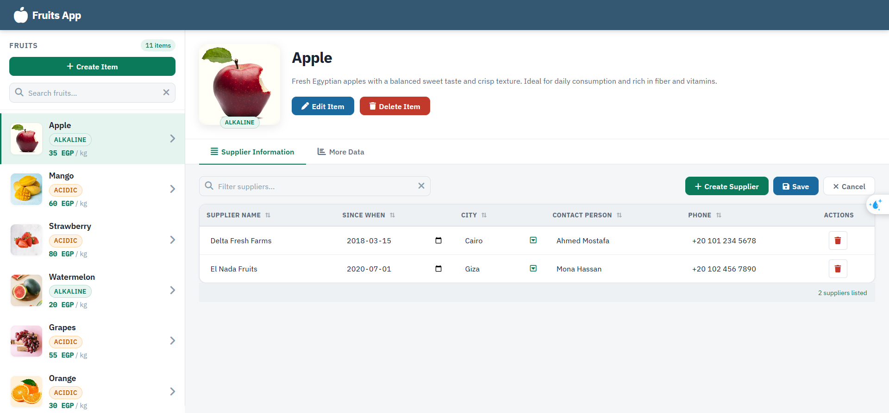

# 🍎 Fruits Management App

A responsive **Master-Detail web application** built with vanilla HTML, CSS, and JavaScript as part of the **SAP Fiori Internship Technical Assessment** at Solex Solution Experts.

---

## 🔗 Live Demo

> **[View Live Application](https://mohamedbayoumi-dev.github.io/Fruits_App/)**

---

## 📸 Preview



---

## ✨ Features

### Core Requirements
- **Master-Detail Layout** — Split-panel UI with a fruit list on the left and detailed view on the right
- **Search & Filter** — Real-time search by fruit name or category
- **Supplier Info Tab** — Editable table with Supplier Name, Since When, City, Contact Person, and Phone
- **More Data Tab** — Displays fruit Type, Price/Unit, and Primary Supplier Name
- **City Value Help** — Dropdown with predefined cities list (F4-style interaction)
- **Save & Cancel** — Persist edits or discard changes

### Bonus Features
- **Sorting** — Click any column header to sort ascending/descending
- **Table Filtering** — Search bar to filter suppliers by name, city, or contact
- **Custom CSS Styling** — IBM Plex Sans font, SAP Fiori-inspired design system with CSS variables
- **LocalStorage Persistence** — All changes survive page refresh

### Extra (Beyond Requirements)
- **Create / Edit / Delete** Fruit Items with confirmation modals
- **Add / Delete Suppliers** per fruit with animated modals
- **Toast Notifications** — Success, info, and error feedback
- **Responsive Design** — Fully usable on mobile and tablet
- **Accessibility** — ARIA roles, keyboard navigation, focus management
- **XSS Protection** — All user input is sanitized via `escapeHtml()`
- **Dirty State Tracking** — Edited rows are visually highlighted until saved

---

## 🛠️ Tech Stack

| Technology | Usage |
|---|---|
| HTML5 | Semantic structure |
| CSS3 | Custom design system, CSS variables, Flexbox/Grid |
| Vanilla JavaScript (ES6+) | State management, DOM manipulation, localStorage |
| Font Awesome 6 | Icons |
| IBM Plex Sans | Typography (via Google Fonts) |

---

## 📁 Project Structure

```
Fruits_App/
├── index.html              # Main entry point
├── js/
│   ├── app.js              # Main application controller
│   └── data.js             # Static fruit & supplier data
├── assets/
│   ├── css/
│   │   ├── style.css       # Component styles
│   │   ├── variables.css   # Design tokens (CSS variables)
│   │   ├── media.css       # Responsive breakpoints
│   │   └── all.css         # Font Awesome icons
│   └── image/              # Fruit images
└── README.md
```

---

## 🚀 Getting Started

### Run Locally

1. **Clone the repository**
   ```bash
   git clone https://github.com/mohamedbayoumi-dev/Fruits_App.git
   cd Fruits_App
   ```

2. **Open in browser**
   ```bash
   # Option A — just open the file
   open index.html

   # Option B — use Live Server (VS Code extension) for best experience
   ```

> No build tools or dependencies required. Pure HTML/CSS/JS.

---

## 📋 Assessment Requirements Checklist

| Requirement | Status |
|---|---|
| Master-Detail Layout | ✅ |
| Fruit list with Image, Name, Category, Price | ✅ |
| Search field | ✅ |
| Detail view: Image, Name, Description | ✅ |
| Tab 1 — Supplier Info table | ✅ |
| Tab 2 — More Data (Type, Price, Supplier) | ✅ |
| City value help (F4 / dropdown) | ✅ |
| Save & Cancel buttons | ✅ |
| Bonus: Sorting & Filtering in table | ✅ |
| Bonus: Custom CSS Styling | ✅ |
| Extra: Create / Edit / Delete Fruit Items | ✅ |
| Extra: Add / Delete Suppliers | ✅ |
| Extra: Toast Notifications | ✅ |
| Extra: Responsive Design (Mobile & Tablet) | ✅ |
| Extra: Keyboard Accessibility & ARIA | ✅ |
| Extra: XSS Protection | ✅ |
| Extra: LocalStorage Persistence | ✅ |
| Extra: Dirty State Tracking | ✅ |

---

## 👤 Author

**Mohamed Bayoumy**
- GitHub: (https://github.com/mohamedbayoumi-dev)
- LinkedIn: (https://www.linkedin.com/in/mohamedbayoumi-dev)

---

## 📄 License

This project was created as part of a technical assessment. All rights reserved.